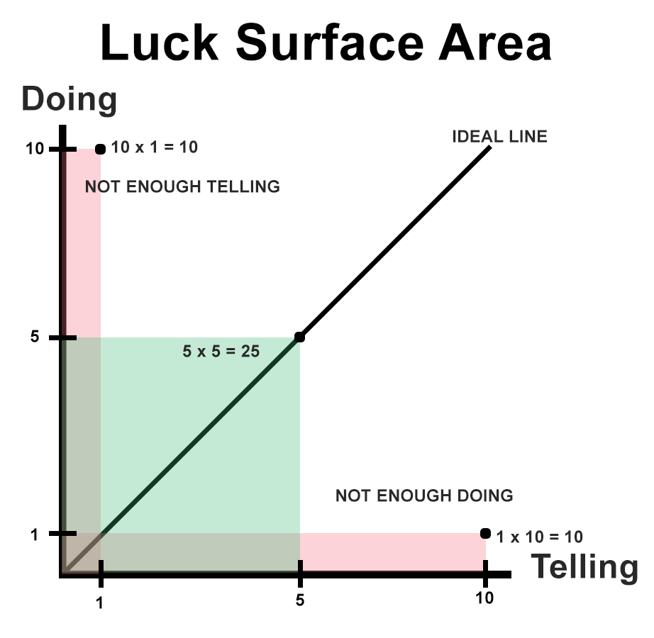

#### Description

The amount of serendipity that will occur in your life, your Luck Surface Area, is directly proportional to the degree to which you do something you're passionate about combined with the total number of people to whom this is effectively communicated. It's a simple concept, but an extremely powerful one because what it implies is that you can directly control the amount of luck you receive. In other words, you make your own luck. [source](https://www.codusoperandi.com/posts/increasing-your-luck-surface-area)

#### Practice

Method1 From doing: 
Think of something you're doing.
How much energy are you putting into doing that thing? 
How much energy are you putting into talking about that thing?
Which one do you need to increase/decrease in order to achieve your largest Luck Surface Area?
What are ways I can do more doing/talking?

Method2 From telling: 
Think of something you're telling.
How much energy are you putting into doing that thing? 
How much energy are you putting into talking about that thing?
Which one do you need to increase/decrease in order to achieve your largest Luck Surface Area?
What are ways I can do more doing/talking?

#### Example-1

Doing: Working on my game
Doing Energy: 10
Telling Energy: 1

I should do more telling to increase my Luck Surface Area

What are ways I can do more talking?
- Have a twitch streaming while I am working & put a button on my website where players can watch me develop the game
- Write blog posts about what we’re doing how we’re doing them etc..

#### Example-2

Doing: Breakdance
Doing Energy: 10
Telling Energy: 0

I should start telling people

What are ways I can do more telling?
- Post insta, fb, wp stories when I practice
- Edit videos of me doing routines, freestlye & maybe create trailers
- Write blog posts on what I learned during my practices & share them on relevant sub reddits

#### Extra

